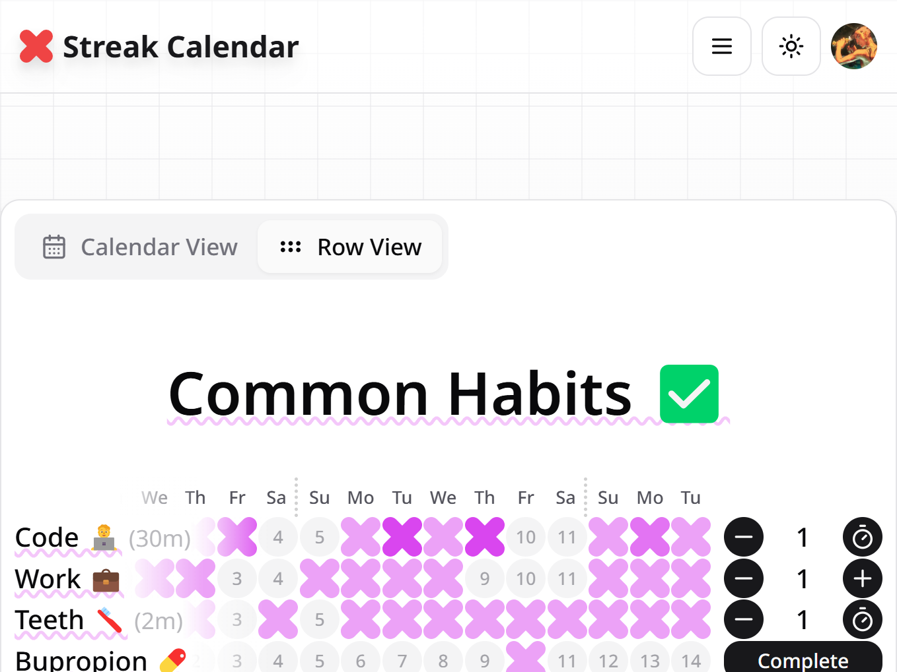
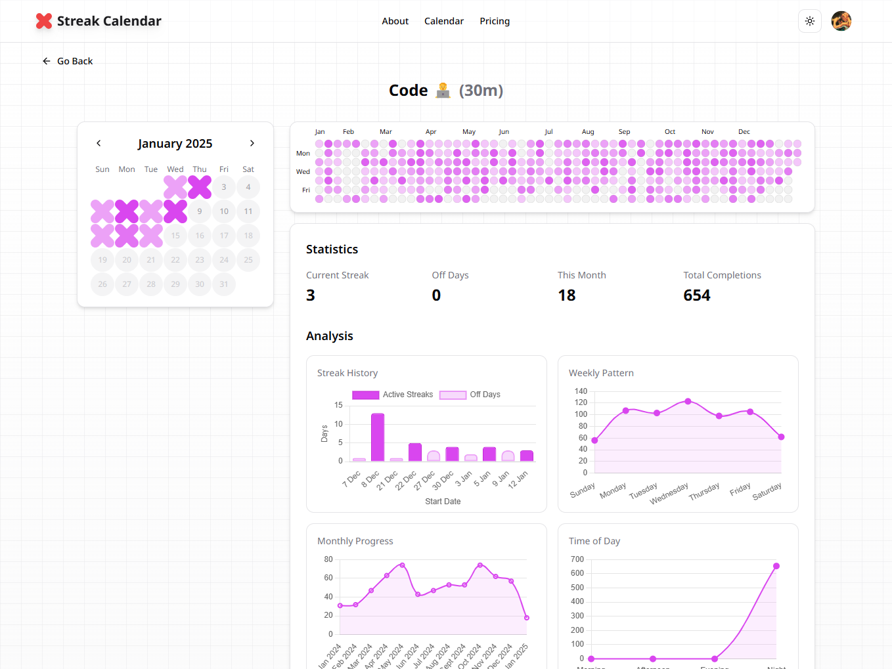

# Streak Calendar

Streak Calendar is an open-source productivity tool for habit tracking, task timing, and progress visualization. It supports multiple calendars and habits, featuring GitHub-style activity grids for tracking achievements.

The project is in its experimental/alpha stage and may experience disruptions due to ongoing feature development. I'll do my best to ensure stability, but users are encouraged to use the temporarily available import/export feature to back up their calendars, habits, and completion history manually.

Licensed under MIT, Streak Calendar is free to use and adapt. Hosting and premium services from Convex and Clerk may incur costs, so an affordable pricing model via Stripe is planned. Users can fork and self-host for full access.

|                          Mobile                           |                         Desktop                          |
| :-------------------------------------------------------: | :------------------------------------------------------: |
|  |  |

## Features

Explore a range of features designed to help you stay motivated and organized:

- **Visual Habit Tracking**: Mark daily accomplishments with X's and keep your streak alive
- **Multi-Habit Support**: Create multiple calendars and assign habits to each
- **Customizable Themes**: Personalize each calendar with a unique color theme
- **Timed Tasks**: Use the built-in timer to track task durations and mark them complete
- **Activity Grid**: See your annual progress in a grid layout inspired by GitHub's contribution tracker
- **Flexible Habit Duration**: Set custom durations for habits to match your needs
- **Responsive Design**: Fully responsive UI that works seamlessly on mobile, tablet, and desktop
- **Dark/Light Mode**: Built-in theme support for comfortable viewing in any lighting
- **Internationalization**: Support for multiple languages and locales
- **Open Source**: A tool built for the community, by the community

## Technologies Used

Built with a modern tech stack to ensure efficiency, scalability, and an engaging user experience:

- Framework: [Next.js](https://nextjs.org/)
- Backend: [Convex](https://www.convex.dev/)
- Authentication: [Clerk](https://clerk.com/)
- Styling: [Tailwind CSS](https://tailwindcss.com/)
- UI: [shadcn/ui](https://ui.shadcn.com/)

Also used: [Canvas Confetti](https://www.kirilv.com/canvas-confetti/), [Chart.js](https://www.chartjs.org/), [date-fns](https://date-fns.org/), [Framer Motion](https://www.framer.com/motion/), [Lucide React](https://lucide.dev/), [next-intl](https://next-intl-docs.vercel.app/), [next-themes](https://www.npmjs.com/package/next-themes), [NumberFlow](https://number-flow.barvian.me/), [Radix UI](https://www.radix-ui.com/), [React](https://react.dev/), [React Activity Calendar](https://grubersjoe.github.io/react-activity-calendar/), [shadcn-pricing-page](https://github.com/aymanch-03/shadcn-pricing-page), [TypeScript](https://www.typescriptlang.org/).

## Getting Started

```bash
# Clone the repository
git clone https://github.com/ilyaizen/streak-calendar.git

# Navigate to the project
cd streak-calendar

# Install dependencies
npm install

# Set up environment variables
cp .env.example .env.local

# Start the development server
npm run dev
```

Visit `http://localhost:3000` to see the app running.

## Project Structure

```
streak-calendar/
├── convex/                # Convex backend functions and schema
├── public/                # Static assets
├── src/
│   ├── app/               # Next.js app router pages and layouts
│   │   ├── [locale]/      # Internationalized routes
│   │   │   ├── about/     # About page
│   │   │   ├── calendar/  # Calendar view routes
│   │   │   ├── calendars/ # Calendars management
│   │   │   ├── habits/    # Habits management
│   │   │   └── pricing/   # Pricing page
│   │   ├── globals.css    # Global styles
│   │   ├── layout.tsx     # Root layout
│   │   └── providers.tsx  # App providers
│   ├── components/        # Reusable UI components
│   │   ├── analytics/     # Google Analytics components
│   │   ├── calendar/      # Calendar-details components
│   │   ├── habit/         # Habit-details components
│   │   ├── ui/            # shadcn/ui components
│   ├── hooks/             # Custom React hooks
│   ├── i18n/              # Internationalization configuration
│   ├── lib/               # Utility functions and configurations
│   ├── messages/          # Translation files
│   ├── types.ts           # TypeScript type definitions
│   └── utils/             # Helper functions and utilities
├── .env.example           # Example environment variables
├── .env.local             # Environment variables
├── .prettierrc            # Prettier configuration
├── components.json        # shadcn/ui components configuration
├── eslint.config.mjs      # ESLint configuration
├── next.config.mjs        # Next.js configuration
├── package.json           # Project dependencies and scripts
├── tailwind.config.ts     # Tailwind CSS configuration
└── tsconfig.json          # TypeScript configuration
```

## Contributing

Streak Calendar is open source to encourage transparency and collaboration. Contributions and innovations from users are welcome, helping to continuously improve the tool and make it even more effective for everyone.


## Support

If you're enjoying using Streak Calendar, drop a ⭐️ on the repo!

<a href="https://buymeacoffee.com/ilyaizen" target="_blank"></a>

## Star History

[](https://star-history.com/#ilyaizen/streak-calendar&Date)

## Links

- Website: [streakcalendar.com](https://streakcalendar.com)
- Creator: [Ilya Aizenberg](https://github.com/ilyaizen)
- Twitter/X: [@StreakCalendar](https://x.com/StreakCalendar)
- Dev.to Article: [Building Streak Calendar: My Journey into Open-Source with the Help of AI](https://dev.to/ilyaizen/building-streak-calendar-my-journey-into-open-source-with-the-help-of-ai-1hbl)

## License

This project is licensed under the [MIT License](LICENSE).

---

Happy tracking! 🎯
